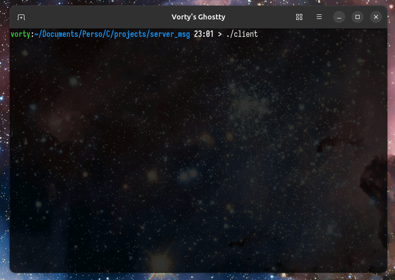

# Echo Server.c && Bubbletea client.go
- **C server using Poll api** to handle multiple clients connections (non-blocking I/O)
- **Go client using BubbleTea lib** to have a beautiful TUI

<p align=center>
    <br/>
    <em>Client simple usage</em>
</p>

## How to build
To build the project follows the below steps
1. **Requirements:**
  - C compiler
  - Golang compiler
    
  You can check by running this command:
  ```
  gcc --version && go version
  ```
2. **Build src:**
  ```
  git clone https://github.com/Vortyy/echo_server
  cd echo_server
  make
  ```
  *Side note -> this commnad will build the client and the server then run the server
  if you want only build remplace make by make build_all*
  ```
  make build_all
  ```
3. **Run client:**
  ```
  ./client
  ```

## Context
Brief context, so this project started when i wanted to learn back socket in C using Poll Api provided by Kernels to do non-blocking I/O programs. Then, after i've finished the server i wanted to implement a small fancy client to communicate with my freshly created server (just to use something else than telnet). I really wanted to do an app using the bubbletea lib so i learned Go and made a TUI client using this lib. The client can be used with any server but just handle send followed by a read operations.

## References
- man poll / socket / sigaction
- [socket](https://tala-informatique.fr/index.php?title=C_socket)
- [BubbleTea](https://github.com/charmbracelet/bubbletea)
- [A tour of Golang](https://go.dev/tour/welcome/1)
